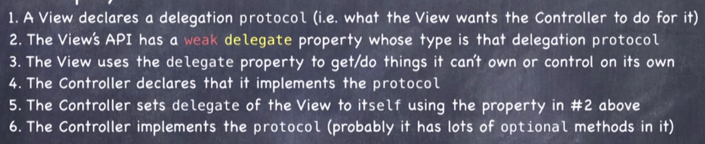

# Swift知识点🧀️

[toc]

------
## Magic in Swift

- Property Observe**r: 

  - 第一次使用的时候不会执行didSet，只有当第一次发生改变的时候才会执行里面的操作

  ```swift
  var flipCount = 0 {
    didSet {        //property observer 每当值改变时执行该代码
      flipCountLabel.text = "Flips: \(flipCount)"
    }
  }
  ```

- **lazy**: 先不初始化变量，直到有人要使用它时

  - lazy变量不能添加didSet
  
- **字符串**

  - 字符串中添加变量：`print("this is a \(varObj)")`

- **Computed Property**

  ```swift
  var foo: Double {
    get {
      // 这里先进行一系列运算再返回一个foo值
    }
    set(newValue) {
      //先对newValue进行一些操作再赋值给foo
    }
  }
  ```

- **Assert**

  ```swift
  // 例子. 断言数组下标合法
  assert(arrar.indices.contain(index), "xxClass.xxfunc(at: \(index)): chosen index not in arr")	//第二个参数是错误提示消息，可自定义
  ```

- **Extensions**: add methods/properties to data struct (even if you don't have the source)

  - **Restrictions**
    - can't re-implement methods or properties that are already there(only add new one)
    - the properties you add can have no storage associated with them(computed only)

  ```swift
  // 扩展Int，使其随机返回某个整数
  extension Int {
    var arc4random: Int {
      if self > 0{
        return Int(arc4random_uniform(UInt32(self)))	//self只用户使用的数作为最大值
      } else if self < 0 {
        return -Int(arc4random_uniform(UInt32(abs(self)))
      } else {
          return 0
        }
    }
  }
  
  let x = 5.arc4random
  ```

- **Optional**

  - 本质上是一个enum

    ```swift
    enum Optional<T>{
      case none
      case some(<T>)
    }
    ```

  - 声明optional: 默认值是nil

    ```swift
    var hello: String?		//var hello: Optional<String> = .none
    var hello: String? = "hello"		// var hello: Optional<String> = .some("hello")
    ```

  - 解包unwrapping

    ```swift
    /* (1) 强制解包 */
    print(hello!)		//一定要是有效值，否则程序崩溃
    
    switch hello {
      case .none: //raise an exception(crash)
      case .some(let data): print(data)
    }
    
    /* (2) 判断后再解包 */
    if let greeting = hello {
      print(greeting)
    } else {
      // do something else
    }
    
    switch hello {
      case .some(let data): print(data)
      case .none: //do something else
    }
    
    /* (3) 语法糖 */
    let greet = hello ?? "foo"
    ```

- **字典**

  - `[Int:String]`


<br />

## Data Structure

- **Access Control**：对外承认这个东西你可以用，保证没问题，内部的实现你可以不断的更改
  - `internal`：（default）usable by any object in my app
  - `private`：只有类的内部才能调用
  - `private(set)`: readable outside, but not settable
  - `fileprivate`: accessible by any code in the .swift file
  - `public`: (for frameworks only) this can be used by objects outside my framework
  - `open`:  (for frameworks only) public and objects outsidee my framework can subclass this


### struct

>  **class和struct的区别**
>
> 1. struct没有inheritance
> 2. struct is value type, class is reference type
>    - value type: 参数、数组成员、赋值时会被copy（系统采用COW机制）
>    - class存在在heap区，可能有20个指针都指向一个对象
>    - struct每次传递时都要复制，但是Swift很聪明，采用COW机制降低复制时的消耗

- 如果func需要改变self的值，需要添加`mutating`


### protocol

- a **type** which is a declaration of <u>functionality only</u>(list of vars and functions, not an implementation)
- Instead of forcing the caller to pass a specific class, struct ..., this can let callers pass any class/struct/../ the caller wants
- no data storage，继承的不是data，只是functionality
- 可以让一些有相同性质的东西不必都继承自同一个base class
- **组成**
  1. protocol declaration
  2. a class, struct declaration that makes the claim to implement the protocol(如果你举手说要实现这个协议，你必须实现（1）规定的所有东西)
  3. the cold that implement the protocol

```swift
/* Declaration */
protocol SomeProtocol: class, InheritedProtocol1 {
  var someProperty: Int { get set}
  mutating func changeIt()
  init(arg: Type)
}
```

```swift
/* Implement */
class SomeClass: SuperClass, SomeProtocol, AnotherProtocol{
  //必须实现协议里的所有东西
  func changeIt() { /*..*/ }		//这里是class，不用加mutating，因为它是引用类型
}

struct SomeStruct: SomeProtocol, AnotherProtocol{
  //implement
  mutating func changeIt() {}
  required init(...)
}
```

```swift
/* Usage */
let someClass: SomeClass = SomeClass()
var x: SomeProtocol = someClass
x.changeIt()

func SomeAndAnother(x: SomeProtocol & AnotherProtocol) {} 	//这个参数必须实现这两个protocol
```

- 如果协议里确定这个func要修改变量，要声明为`mutating`

  - 如果确定这个协议不会被struct实现，则要在`:`后面第一个写class，这样协议中的func也不必添加`mutating`

- 实现protocol中的`init()`需要添加`required`，这样子类就不必再去实现了

- 甚至可以让Int实现protocol

  ```swift
  extension Int: SomeProtocol {
    
  }
  ```

  ```swift
  /* 🌰 扩展Collection，增加一个变量，返回集合仅有的一个元素，否则nil */
  extension Collection {
    var oneAndOnly: Element ? {		//Element指代集合中元素的类型
      return count ==1 ? first : nil
    }
  }
  ```

  

- **Delegation**：bind communication between View and Controller

  

> 🌰. **Equatable**: Swift中 x == y其实就是区找这个协议，任何实现了这个协议的class/struct都可以使用==（Int类型也是如此）
>
> ```swift
> protocol Equatable {
>   static func ==(lsh: Self, rhs: Self) -> Bool	//Self代表实现这个协议的类型
> }
> ```
>
> 🌰. **Hashable**
>
> ```swift 
> protocol Hashable: Equatable {
>   var hashValue: Int { get }
> }
> ```
>
> **让自定义类型作为字典的key**：只需实现Hashable协议
>
> 🌰. **Sequence**：实现这个协议的data struct可以使用`for in`, `contains()`, `min()`, `filter()`,`map()`, etc.
>
> 🌰. **Collection**: 实现这个协议的data struct可以使用 `[]`, `index(of: )`, etc.


### String

- 不是通过Int进行索引，而是`String.Index`(有些字符不止用一位来存储)

  > 🌰. 获取第四个字符
  >
  > ```swift
  > str[str.index(str.startIndex, offsetBy: 3)]
  > ```
  >
  > 🌰. 获取第二个词
  >
  > ```swift
  > if let firstSpace = str.index(of: " "){
  > let secondWordIndex = str.index(firstSpace, offsetBy: 1)
  > let secondWofd = str[secondWordIndex..<str.endIndex]
  > }
  > 
  > str.components(separatedBy: " ")[1]
  > ```

- 将字符串转化为字符数组: `Array(str)`, 类型是`Array<Character>`

- **NSAttributedString**: 字符串中的每一个字符于一个小Dictionary关联(objective-C's old API)

  - 字典的key可能是font，color这些
  - 许多字符可以有相同的字典

  ```swift
  let attributes: [NSAttributedStringKey: Any] = [	//这里只是举例，永远不要用Any，可以自定义个一个Enum解决
    	.strokeColor: UIColor.orange,
    .strokeWidth: 5.0
  ]
  let attributedString = NSAttributedString(string: "hello", attributes: attributes)
  somelabel.attributedText = attributedString 	//赋给Label中的text
  ```


### Tuple

lightweight data structure which only contain the value

```swift
let x: (String, Int, Double) = ("hello", 5, 1.1)
let (word, number, value) = x		//元组可以给多个变量赋值

let x: (word: String, number: Int, value: Double) = ("hello", 5, 1.1)
x.word		//使用元组中的属性
```

- tuples as return values

  ```swift
  func getSize() -> (weight: Double, height: Double) { return (250, 80) }
  ```


### enum

- 可以有associated data

```swift
enum FastFoodMenuItem{
  case hamburger(numberOfPatties: Int)
  case fries(size: FryOrderSize)
  case drink
}
enum FryOrderSize{
  case large
  case small
}

let menuItem: FastFoodMenuItem = .drink	//可以省略前面
let otherMenuItem: .drink		// x 没法推到出类型

switch menuItem {
  case .hamburger(let pattyCount): //这里可以使用associated data
  case .fries: //也可以不获取
  case .drink:
  default: 
}
```


### Countable Range

Swift中的for-in必须是一个countable range

```swift
// 0.5...15.25 只是一个range，不是一个countablerange
for i in stride(from: 0.5, through: 15.25, by: 0.3) {}
for i in stride(from: 0.5, to: 15.25, by: 0.3) {}
```


### Function Types

```swift
var operation: (Double) -> Double
operation = sqrt
let result = operation(4.0)
```

#### Clousures

- 有点类似与inline function

  ```swift
  /* 🌰 取负数 */
  var operation: (Double) -> Double
  operation = { -$0 }		// operation = { (num: Double) -> (Double) in return -num }	的简写
  let result = operation(4.0)
  ```

- trailing clousure：如果一个函数的最后一个参数是闭包，可以将闭包移到函数调用的`()`后面；如果闭包是唯一的参数，可以不写`()`

  ```swift
  let arr1 = arr.map({ -$0 })
  let arr2 = arr.map() { 1.0 / $0 }
  let arr3 = arr.map { String($0) }
  ```

- 用于property initialization: 尤其适合lazy

  ```swift
  var someProperty: Type = {
    // calculate
    return someValue
  }()
  ```

- clousure是reference type，它会捕获局部变量供自己使用，这些surrounding code也会被带到heap中


<br />

## Memory Management

### Automatic Reference Countiing

it is NOT garbage collection

- reference type (classes) are stored in the heap
- counts references to each of them and when there are zero references, they get tossed
- **Influencing ARC**: 对变量设置关键字
  - strong: default 不是关键字 as long as anyone, anywhere has a strong pointer to an instance, it will stay in the heap
  - `weak`: if no one else is interested in this, then neither am I, set me to nil in that case
    - 由于该变量可能被设为nil，所以它也必须是optional
    - 例. outlets(strongly held by the view hierarchy)
  - `unowned`: 对heap说我比ARC更厉害，听我的，我让你释放再释放
    - 一般只用在引用循环（我引用你，你引用我，但是没有任何其他人引用你我，cycle导致你我都留在heap中出不去）