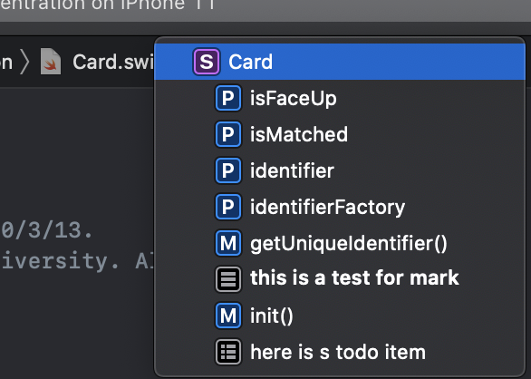

# Xcode

[toc]

------

## 快捷键

⌘⌥⇧⌃

- **左侧Navigator**: ⌘ + 0
  - ⌘ + 1/2/3/4/5 用于切换左侧tab
- **右侧Inspector**：⌘ + ⌥ + 0
  - ⌘ + ⌥ + 1/2/3 用于切换右侧tab
- **下侧console**：⌘ + ⇧ + Y
- **快速打开文件**：⌘ + ⇧ + O
- **打开Library**：⌘ + ⇧ + L
- **清理项目**：⌘ + ⇧ + K
- **重新build**：⌘ + B
- **run**：⌘ + R
- **格式化文档**：⌃ + I


## 标记



- // MARK
- //TODO


## Debug

### (lldb)

```
po someObject
p someVar
```

- `po`: print object
- `p`: print anything


## Project

- **Building Setting**
  - figure out what vision of programming language
- **Building Phases**
  - all source files that are used inside the app
  - library