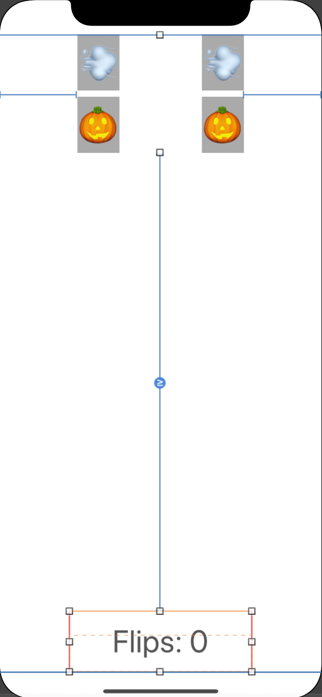

# Storyboard

[toc]

------

## 界面连接代码

1. + ⌃ + 鼠标拖动组件到代码中

   （⚠️更改Type）

   - Outlet：属性
   - Action：方法
   - Outlet Collection：属性数组（注意添加的顺序）

## MVC

- **Model**: What
  - 不依赖于UI的一系列对象
  - 游戏信息、游戏规则
  - 不负责呈现
- **View**：UI things
  - Controller's minions
- **Controller**：How
  - how it shows up on screen

## AutoLayout

- 先将ui embed in Stack中

- ⌃ + UI Group 

  - 拖动到屏幕边缘：与边缘的constraint
  - 拖动到屏幕上：水平constraint或垂直constraint

  