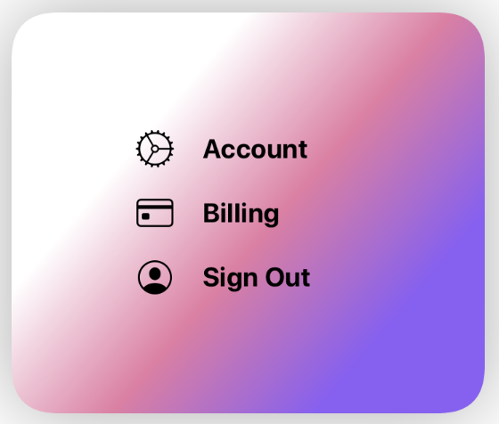
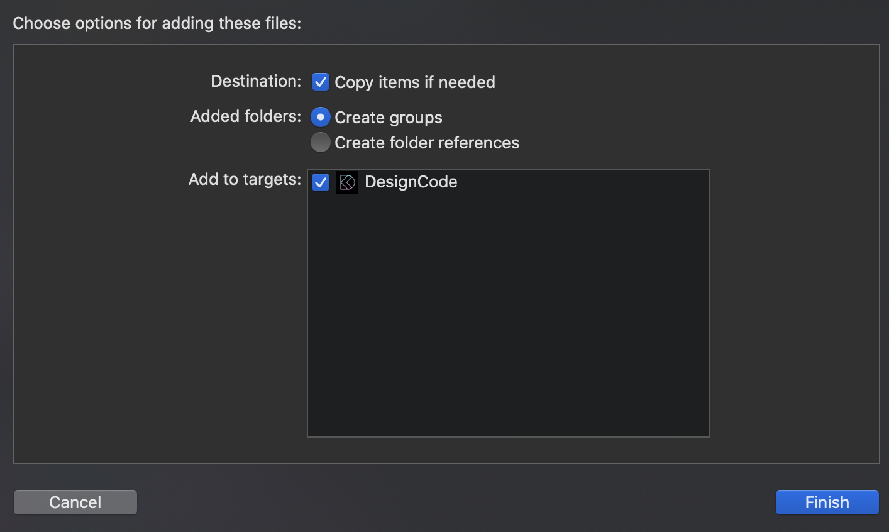
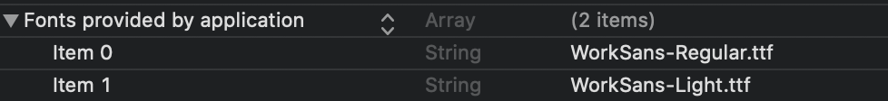
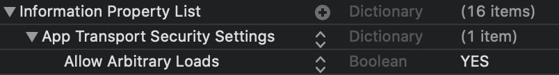
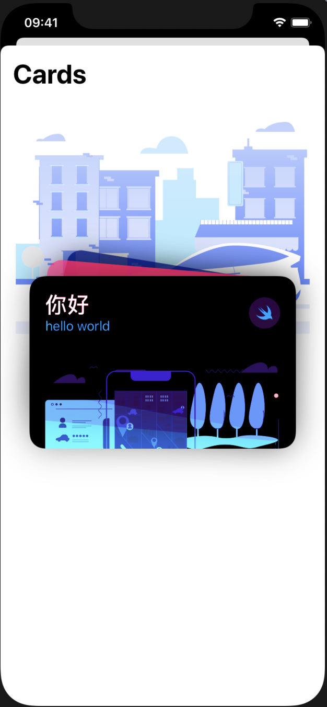

# SwiftUI

[toc]

------

## View

- **精细的圆角**: `.clipShape(RoundedRectangle(cornerRadius: 30, style: .continuous))`

- **精细的阴影**：`.shadow(color: Color.black.opacity(0.2), radius: 20, x: 0, y: 20)`

  - 比较常用的配置是（10，0，0）或（20，0，20）

- **渐变颜色**：`Gradient`

  - Linear
  - Angular
  - Radial

  

- **颜色方块**：`Color(Color Literal)`

- **覆盖物**: `overlay()`

- **按钮**

  ```swift
  /* 图像按钮 */
  Button(action: { self.showProfile.toggle() }) {
    Image("Avatar")
    .renderingMode(.original)       //使得button里的图像渲染正常
  }
  ```

- **屏幕尺寸**: `let screen = UIScreen.main.bounds`

- **同时预览多个设备**

  ```swift
  Group {
    TabBar().previewDevice("iPhone 8")
    TabBar().previewDevice("iPhone 11")
  }
  ```

- **好看的背景过渡颜色**

  ```swift
  .background(
    VStack {
      LinearGradient(gradient: Gradient(colors: [Color("background_gradient"), Color.white]), startPoint: .top, endPoint: .bottom)
      .frame(height: 200)
      Spacer()
    }
    .background(Color.white)
  )
  ```

- **隐藏刘海中的内容**：`.statusBar(hidden: true)`

- **颜色变化**：`.hueRotation(Angle(degrees: ))`

------

## Modifier

- 自定义（组合拳）

  ```swift
  /* usage */
  .modifier(ShadowModifier())
  
  /* define */
  import SwiftUI
  
  struct ShadowModifier: ViewModifier{
      func body(content: Content) -> some View{
          content
        			//这里是自定义的modifier
              .shadow(color: Color.black.opacity(0.2), radius: 20, x: 0, y: 20)
              .shadow(color: Color.black.opacity(0.1), radius: 1, x: 0, y: 1)
      }
  }
  ```

  


------

## Animation

- 基本用法

  ```swift
  .blur(radius: show ? 20 : 0)		//通过一位flag表示状态
  .rotationEffect(Angle(degrees: show ? 0 : 5))
  //...
  .animation(.easeInOut(duration: 0.5))		//一般设置为easeInOut或default效果比较好
  ```

- spring：物理模拟

  - response: 延迟  数值越大越有滞留感
  - dampingFraction: 阻尼  数值越小阻尼越小
  - blendDuration: 反弹
  
- timingCurve：自定义动画曲线

  ```swift
  .animation(.timingCurve(0.2, 0.8, 0.2, 1, duration: 0.8))
  ```

  [自动生成动画曲线网站](https://cubic-bezier.com/)

- 自定义更多modifier

  ```swift
  .animation(
    Animation
      .easeInOut
      .delay(0.1)
      .speed(2)
  )
  ```

- 最里层的动画先执行，所以父亲再添加动画不会覆盖掉子的


------

## Gesture

- 要将状态和动画放在手势之前以防止延迟

- 拖拽

  ```swift
  /*实现拖拽时跟着手指动，释放时回到原处*/
  @State var viewState = CGSize.zero
  
  .offset(x: viewState.width, y: viewState.height)
  .animation(.spring(response: 0.3, dampingFraction: 0.6, blendDuration: 0))
  .gesture(
    DragGesture().onChanged { value in
      self.viewState = value.translation
    }
    .onEnded{ value in
      self.viewState = .zero
    }
  )
  ```

  
  
  

- 底部菜单拖拽硬逻辑

  ```swift
  /*
  底部菜单手势
  1. 向下拖动到>50消失
  2. 向上拖动到<-100置顶(-300)
  3. <50 >-100时恢复原位置
  4. 置顶情况下不能继续拖动
  5. 置顶情况下>-250消失
  6. 指定情况下<-250恢复原位置
  */
  .gesture(
    DragGesture().onChanged{ value in
                            self.bottomState = value.translation    //正常情况跟随手指位置移动
                            if self.showFull{       //置顶模式下跟随手指移动位置要平移一个300
                              self.bottomState.height += -300
                            }
                            if self.bottomState.height < -300{  //（4）
                              self.bottomState.height = -300
                              self.showFull = true
                            }
                           }
    .onEnded{ value in
             if !self.showFull{      //非置顶下
               if self.bottomState.height > 50{    //（1）
                 self.showCard = false
                 self.bottomState.height = .zero
               }else if self.bottomState.height < -100{    //（2）
                 self.bottomState.height = -300
                 self.showFull = true
               }else{
                 self.bottomState.height = .zero
               }
             }else{                  //置顶情况下
               if self.bottomState.height > -250{  //（5）
                 self.showCard = false
                 self.showFull = false
                 self.bottomState.height = .zero
               }else{
                 self.bottomState.height = -300  //（6）
               }
             }
            }
  )
  Text("\(showFull ? 1 : 0)").offset(y:-340)
  Text("\(bottomState.height)").offset(y:-320)
  ```

  


------

## Font

- `.font(.system(size: 20, weight: .blod, design: .default))`

- 安装自定义字体

  1. 将字体文件夹拖入目录中

     

  2. `Info.plist`中填写要使用的`.ttf`

     

------

## Image

- **图像方块**: `Image(uiImage: Image Literal)`

- `resizeable()`：让图片可以被调整
- `aspectRatio()`：填充方式
- `.clipShape(Circle())`: 将图片裁剪为avatar


### SF Symbol | 图标

- `Image(systemName: "creditcard")`
- `.imageScale(.large)`


### SDWebImage 网络图像

https://github.com/SDWebImage/SDWebImageSwiftUI.git

```swift
import SDWebImageSwiftUI

WebImage(url: URL(string: "https://..."))
```


------

## 数据

### 遍历

- 按照索引遍历

  ```swift
  ForEach(courses.indices, id: \.self) { index in
  	//...
  }
  ```

  


### 数据传递

```swift
/* main view */
MenuView(title: "title param", icon: "icon param")

/* subview */
var title: String		//当不指定默认值时必须要传递
var icon: String = "gear"
```


### Binding | 数据绑定

- 同一个文件中

  ```swift
  /* main view */
  @State var show = false
  MenuView(show : $show)  //$使得同步变化
  
  /* subview */
  @Binding var show : Bool    //从主组建那里监听show
  ```

- 不同文件间

  ```swift
  /* 状态定义在A中，文件A里调用文件B里的View */
  /* A */
  @State var viewState = CGSize.zero
  HomeView(showProfile: $showProfile)
  
  /* B */
  @Binding var showProfile : Bool
  AvatarView(showProfile: $showProfile)
  
  struct HomeView_Previews: PreviewProvider {
      static var previews: some View {
          HomeView(showProfile: .constant(false))
      }
  }
  ```


### API and JSON

- **获取数据**

  ```swift
  /* View */
  struct Post: Codable, Identifiable {
      let id = UUID()
      var title: String
      var body: String
  }
  
  class Api {
      func getPosts(completion: @escaping ([Post]) -> ()) {
          guard let url = URL(string: "http://jsonplaceholder.typicode.com/posts") else { return }
          
          URLSession.shared.dataTask(with: url) { (data, _, _) in
              guard let data = data else { return }
              
              let posts = try! JSONDecoder().decode([Post].self, from: data)
              
              DispatchQueue.main.async {      //不用等到全获取再返回
                  completion(posts)
              }
              print(posts)
          }
          .resume()
      }
  }
  ```

- **使用数据**

  ```swift
  /* Data */
  @State var posts: [Post] = []
  List(posts) { post in
     Text(post.title)
  }
  .onAppear{
    Api().getPosts { (posts) in
       self.posts = posts
    }
  }
  ```

- **Combine方式使用数据**

  ```swift
  /* DataStore */
  import Combine
  
  class DataStore: ObservableObject {
      @Published var posts: [Post] = []
      
      init() {
          getPosts()
      }
      
      func getPosts() {
          Api().getPosts { (posts) in
              self.posts = posts
          }
      }
  }
  ```

  ```swift
  /* View */
  @ObservedObject var store = DataStore()
      
  var body: some View {
    List(store.posts) { post in
      Text(post.title)
    }
  }
  ```

> **如果报错无法访问API等问题**
>
> 


### Contentful API

https://github.com/contentful/contentful.swift.git

自定义动态数据，每次修改不需要release一个新版本

- [Contentful网站](https://www.contentful.com)填写数据

  1. 创建**Content Mode** 
     - add field
  2. 填写**Content**
     - add Entry
  3. **Setting - API keys**
     - space id
     - access token

- 使用数据

  ```swift
  /* Store */
  import Contentful
  import Combine
  
  let client = Client(spaceId: "", accessToken: "")			//(3)获取的两项
  
  func getArray(id: String, completion: @escaping([Entry]) -> ()) {
      let query = Query.where(contentTypeId: id)        //content model
      
      client.fetchArray(of: Entry.self, matching: query) { result in
          switch result {
          case .success(let array):
              DispatchQueue.main.async {
                  completion(array.items)
              }
          case .error(let error):
              print(error)
          }
      }
  }
  
  class CourseStore: ObservableObject {
      @Published var courses: [Course] = courseData		//默认值
      
      init() {
          getArray(id: "course") { (items) in		//（1）的model名
              items.forEach { (item) in
                  /* 使用数据 */
                  self.courses.append(Course(
                      title: item.fields["title"] as! String,		//（1）field名
                      subtitle: item.fields["subtitle"] as! String
                    	image: item.fields.linkedAsset(at: "image")?.url ?? URL(string: "")!,   //如果没有值的缺省值 ！！image的类型为URL
                  )
                  )
              }
          }
      }
  }
  ```

  ```swift
  /* View */
  @ObservedObject var store = CourseStore()
  
  store.courses		//即为动态数据
  ```

  

------

## 页面切换

- 系统页面present: 以上方卡片的方式呈现，有包括退出的默认手势，但是很多自定义的东西无法响应

  ```swift
  .sheet(isPresented: $showUpdate){
    ContentView()
  }
  ```

  

- 根据状态显示页面，达到页面切换的效果

  ```swift
  if showContent{
    Color.white.edgesIgnoringSafeArea(.all)
    ContentView()
  }
  ```

  

------

## TabBar

```swift
TabView {
  Home().tabItem{
    Text("Home")
    Image(systemName: "play.circle.fill")
  }
  ContentView().tabItem{
     Image(systemName: "rectangle.stack.fill")
     Text("Cards")
  }
}
.edgesIgnoringSafeArea(.top)
```


------

## 暗黑模式

- 调整为暗黑模式

  ```swift
  //在XxxView_Preview()里设置
  XxxView().environment(\.colorScheme, .dark)
  ```

  