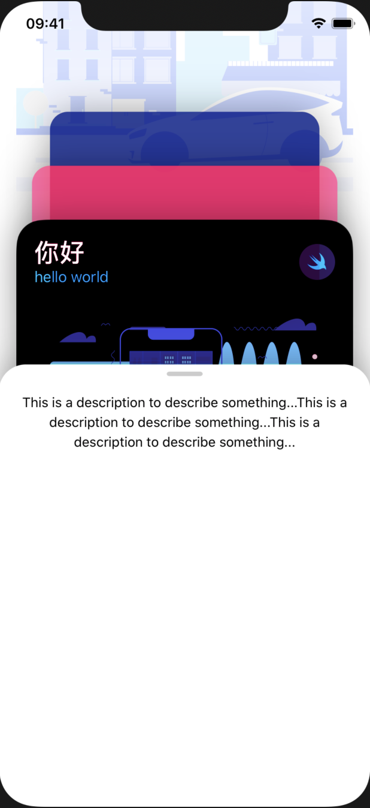

# View

[toc]

------

## 小组件

### 退出小圆圈

```swift
Image(systemName: "xmark")
  .frame(width: 36, height: 36)
  .foregroundColor(.white)
  .background(Color.black)
  .clipShape(Circle())
```

```swift
/* 从屏幕上方进入动画 */
.transition(.move(edge: .top))
.animation(.spring(response: 0.6, dampingFraction: 0.8, blendDuration: 0))
```


### 卡片小把手

```swift
Rectangle()
  .frame(width: 40, height: 5)
  .cornerRadius(3)
  .opacity(0.2)
```


### 进度条


```swift
Color.white
  .frame(width: 38, height: 6)
  .cornerRadius(3)
  .frame(width: 130, height: 6, alignment: .leading)
  .background(Color(#colorLiteral(red: 0, green: 0, blue: 0, alpha: 1)).opacity(0.08))
  .cornerRadius(3)
  .padding()
  .frame(width: 150, height: 24)
  .background(Color(#colorLiteral(red: 0, green: 0, blue: 0, alpha: 1)).opacity(0.1))
  .cornerRadius(12)
```


### 圆环进度条


```swift
struct RingView: View {
  var color1 = #colorLiteral(red: 0.8078431487, green: 0.02745098062, blue: 0.3333333433, alpha: 1)
  var color2 = #colorLiteral(red: 0.2196078449, green: 0.007843137719, blue: 0.8549019694, alpha: 1)
  var width: CGFloat = 200
  var height: CGFloat = 200
  var percent: CGFloat = 82

  var body: some View {
    let multiplier = width / 44     //线宽的比例系数
    let progress = 1 - (percent / 100)  //进度值比例系数


    return ZStack {
      Circle()
      .stroke(Color.black.opacity(0.1), style: StrokeStyle(lineWidth: 5 * multiplier))
      .frame(width: width, height: height)

      Circle()
      .trim(from: progress, to: 1)     //裁剪圆环  1/10
      .stroke(
        LinearGradient(gradient: Gradient(colors: [Color(color1), Color(color2)]), startPoint: .topTrailing, endPoint: .bottomLeading),
        style: StrokeStyle(lineWidth: 5 * multiplier, lineCap: .round, lineJoin: .round, miterLimit: .infinity, dash: [20, 0], dashPhase: 0)
      )
      .rotationEffect(Angle(degrees: 90))     //旋转改变缺口方向
      .rotation3DEffect(Angle(degrees: 180), axis: (x: 1, y: 0, z: 0))
      .frame(width: width, height: height)
      .shadow(color: Color(color2).opacity(0.1), radius: 3 * multiplier, x: 0, y: 3 * multiplier)

      //                .animation(.easeInOut)    //在外部使用的时候定义动画
      
      Text("\(Int(percent))%")
      .font(.system(size: 14 * multiplier))
      .fontWeight(.bold)
    }
  }
}
```


### 动态Navigator

- Navigation View


```swift
/* UpdateList */
@ObservedObject var store = UpdateStore()
    
func addUpdate() {
  store.updates.append(Update(image: "Card1", title: "New Item", text: "New Text", data: "Jan New"))
}

NavigationView {
  List{
    /* 多项item */
    ForEach(store.updates) { update in
        NavigationLink(destination: UpdateDetail(update: update)) {
                              //View
        }
    }

    /* 右扫删除API */
    .onDelete{ index in
              self.store.updates.remove(at: index.first!)     //forcing the data is not option
    }
    /* Edit模式下排序 */
    .onMove{ (source: IndexSet, destination: Int) in
            self.store.updates.move(fromOffsets: source, toOffset: destination)
    }
  }
  /* Navigator主标题（会传递到下一层）*/
  .navigationBarTitle(Text("One"))
  /* Navigator左上角的addupdate 和 右上角的Edit*/
  .navigationBarItems(
    leading: Button(action: addUpdate) {
      Text("Add One")
    },
    trailing: EditButton()
  )
}

```

```swift
/* UpdateDetail */
var update : Update

ScrollView {		//跳转后的界面有系统滑动特效
  VStack {
    Image(update.image)
    .resizable()
    .aspectRatio(contentMode: .fit)
    .frame(maxWidth: .infinity)

    Text(update.text)
    .frame(maxWidth: .infinity, alignment: .leading)
    .padding(.horizontal, 20)
  }
  .navigationBarTitle(update.title)   //navigator导航的文字
}
.listStyle(GroupedListStyle())	//DefaultListStyle PlainListStyle
```

```swift
/* UpdateStore */
import Combine

struct Update: Identifiable{
    var id = UUID()
    var image: String
    var title: String
    var text: String
    var data: String
}

let updateData = [
    Update(image: "Card1", title: "SwiftUI11", text: "...", data: "Jan 1"),
		//...
]

class UpdateStore: ObservableObject{
    @Published var updates: [Update] = updateData
}
```


------

## 钱包card

- single card

  > Extract Subview,  foregroundColor, Spacer, padding, aspectRadio, frame, background, cornerRadius, shadow, VStack, HStack, ZStack

  
  
- multi card

  > scaleEffect, rotationEffect, rotation3DEffect, blendMode
  
- card

  > Rectangle, opacity, VStack(spacing: 20)

<br/>

## 底部卡片

```swift
VStack(spacing:20) {
  Rectangle()
  .frame(width: 40, height: 5)
  .cornerRadius(3)
  .opacity(0.2)

  Text("test")
  .font(.subheadline)
  .multilineTextAlignment(.center)
  .lineSpacing(4)
  Spacer()
}
.padding(.top, 8)
.padding(.horizontal, 20)
.frame(maxWidth: .infinity)
.background(Color.white)
.cornerRadius(30)
.shadow(radius: 20)
```




## Menu菜单

```swift
Button(action: { self.show.toggle() }) {
  Text("Open Menu")
}
```

```swift
/* 顺序很重要 */
.rotation3DEffect(Angle(degrees: show ? 0 : 60), axis: (x: 0, y: 10.0, z: 0))
.animation(.default)
.offset(x: show ? 0 : -UIScreen.main.bounds.width)     //屏幕尺寸
.onTapGesture {
  self.show.toggle()
}
```


------

## ScrollView

- 会限制范围，所以要ignore safe area

- 水平移动卡片

  ```swift
  ScrollView(.horizontal, showsIndicators: false) {	//第二个参数不显示滚动小条AS
    HStack {
      ForEach(0 ..< 5) { item in
          SectionView()
      }
    }
  }
  ```

- 3D水平移动动画

   `geometry.frame(in: .global)` : get frame value from my card(position size)

  ```swift
  .rotation3DEffect(Angle(degrees:
      Double(geometry.frame(in: .global).minX - 30)   / -20
  ), axis: (x: 0, y: 10.0, z: 0))
  ```

  ```swift
  .rotation3DEffect(Angle(degrees:
     Double(geometry.frame(in: .global).minX )
  ), axis: (x: 10.0, y: 10.0, z: 10.0))
  ```

  

  

##全屏扩展

